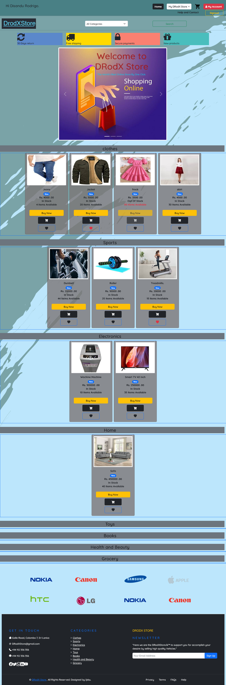
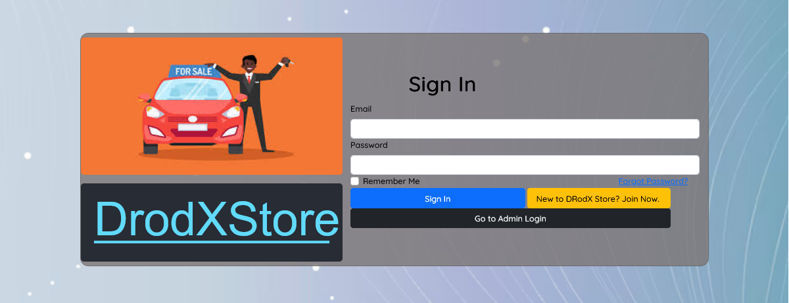
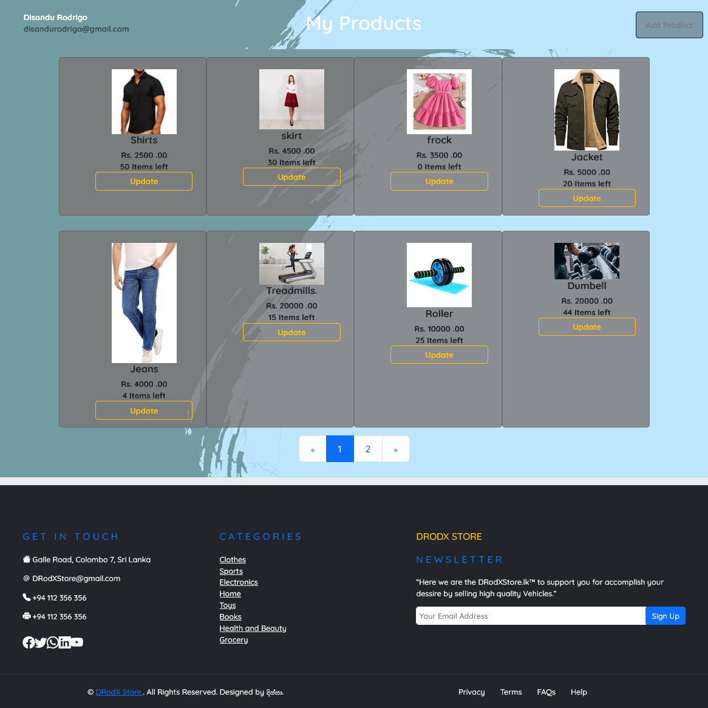
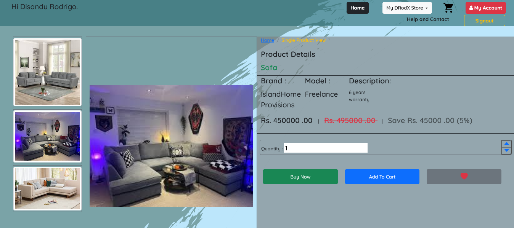
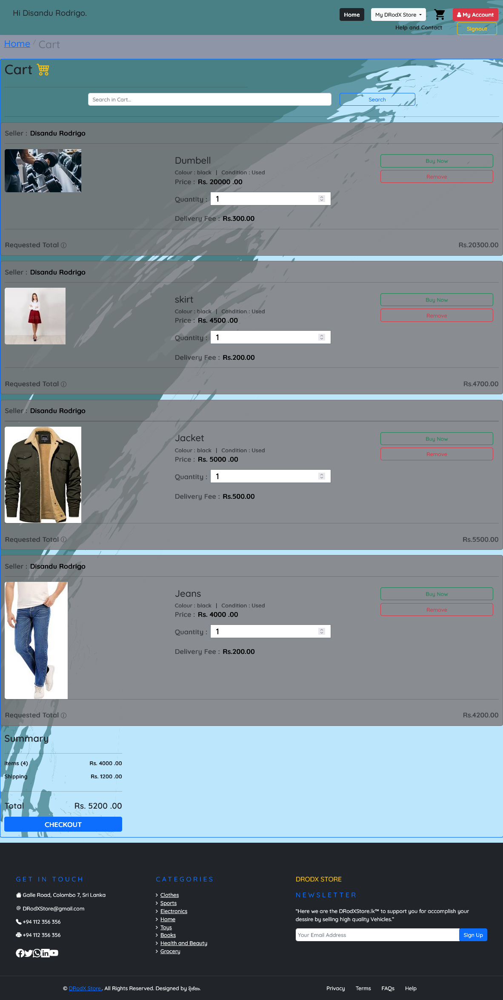
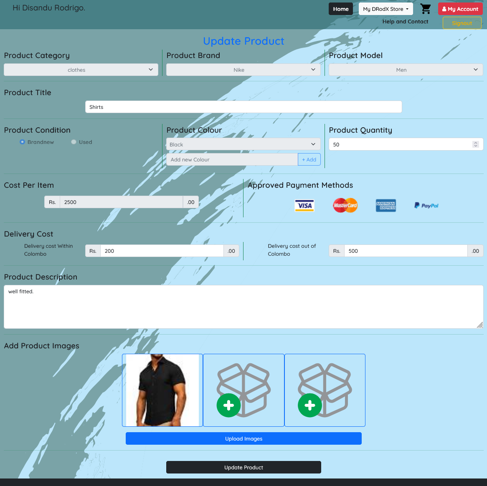
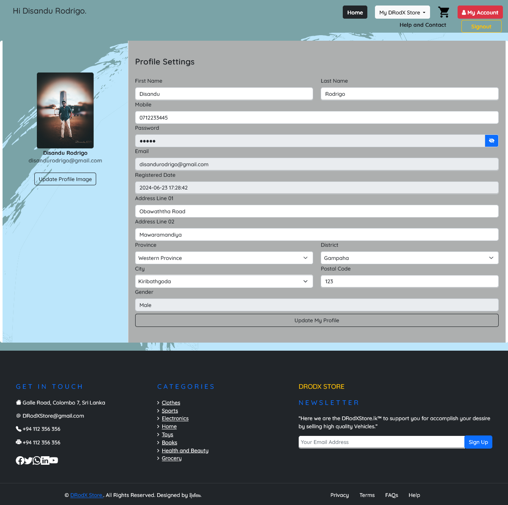
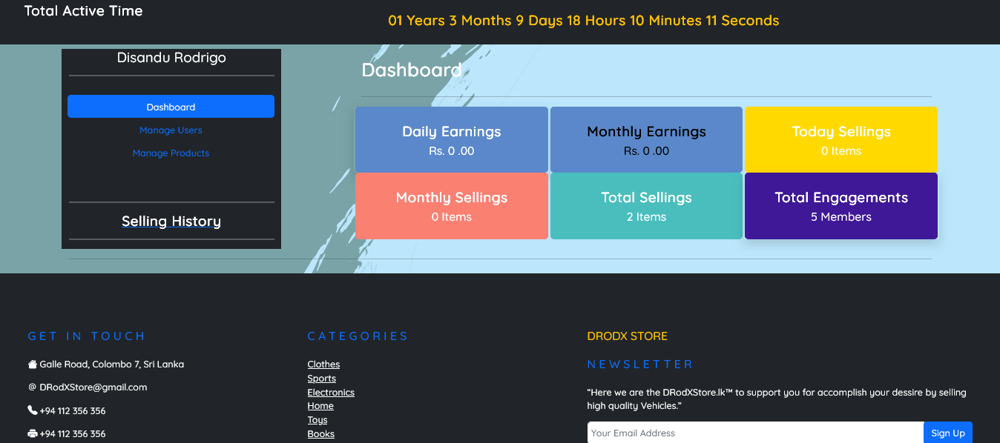
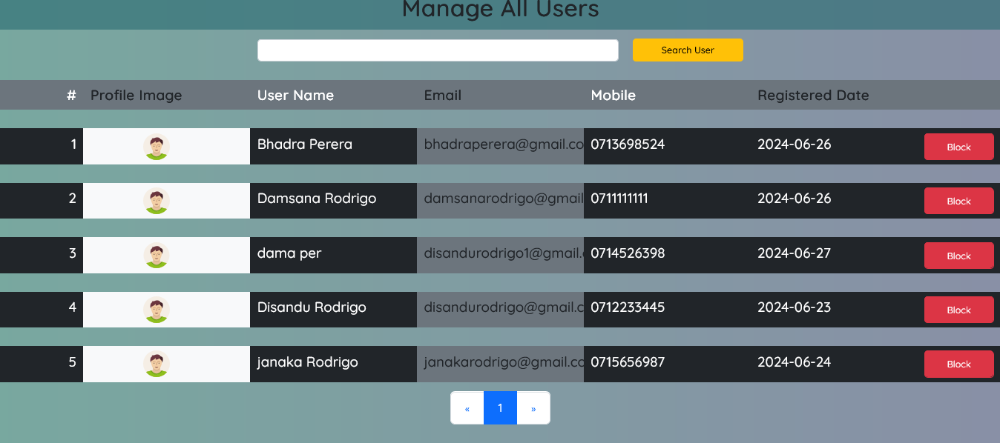
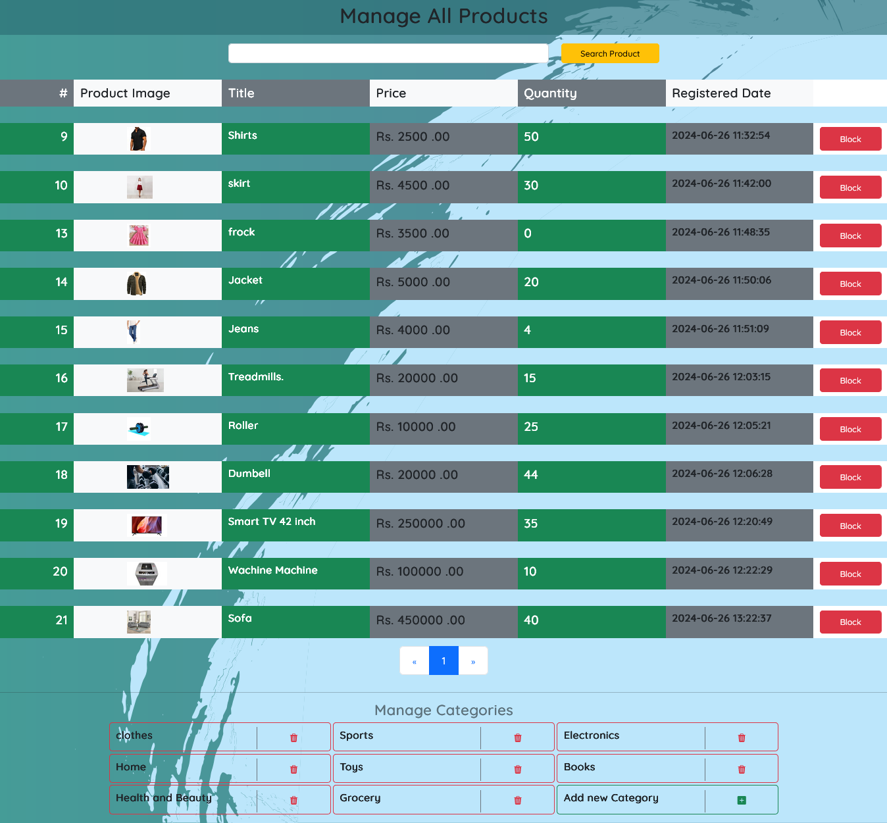

# 🛍️ DrodXStore Online Store

**DrodXStore** is a modern and responsive online store web application designed to deliver a smooth shopping experience for both **customers** and **administrators**.
Built using **PHP**, **HTML**, **CSS**, **JavaScript**, and **Bootstrap**, the platform provides all the essential e-commerce functionalities — from product browsing and purchasing to user and admin management.

---

## 🚀 Features

### 🧑‍💻 User Interfaces

* **Sign In / Sign Up**
* **Home Page** – Browse featured and latest products
* **User Profile** – View and update personal information
* **My Products** – Manage your uploaded items
* **Add Product** – Post new products for sale
* **Advanced Search** – Filter products by category, price, and more
* **Single Product View** – Detailed product page
* **Watchlist** – Save favorite products
* **Cart** – Add, remove, or checkout products
* **Invoice** – View and download order invoices

### 🧑‍💼 Admin Interfaces

* **Admin Sign In**
* **Admin Dashboard**
* **Manage Products**
* **Manage Users**

---

## 🔄 Core Processes

| Process                     | Description                                            |
| --------------------------- | ------------------------------------------------------ |
| **Sign In / Sign Up**       | User authentication and account creation               |
| **Sign Out**                | Securely log out from the system                       |
| **Forgot / Reset Password** | Recover and reset user credentials                     |
| **Update Profile**          | Modify personal or account details                     |
| **Add / Update Product**    | Add new products or edit existing ones                 |
| **Basic & Advanced Search** | Search for products by keywords or filters             |
| **Watchlist**               | Add or remove items from the watchlist                 |
| **Add to Cart / Buy Now**   | Purchase products directly or via the cart             |
| **Save Invoice**            | Generate and store invoices after successful purchases |
| **Admin Verification**      | Authenticate admin users                               |
| **Manage Users / Products** | Admin can update, delete, or verify users and items    |

---

## 🛠️ Technologies Used

| Technology      | Purpose                             |
| --------------- | ----------------------------------- |
| **PHP**         | Core backend development            |
| **HTML5**       | Page structure and content          |
| **CSS3**        | Styling and layout                  |
| **JavaScript**  | Client-side logic and interactivity |
| **Bootstrap 5** | Responsive front-end design         |
| **MySQL**       | Database management                 |

---


## ⚙️ Setup & Installation

Follow these steps to run the project locally.

1. **Clone the repository**

   ```bash
   git clone https://github.com/DisanduRodrigo/DrodXStore.git
   cd DrodXStore
   ```

2. **Import the database**

   * Create a new MySQL database (e.g., `drodxstore_db`).
   * Import the provided SQL file located in the `database/` directory.

     * **Using phpMyAdmin:** open phpMyAdmin → select the `drodxstore_db` database → Import → choose the SQL file → Go.
     * **Using MySQL CLI:**

       ```bash
       mysql -u root -p drodxstore_db < database/drodxstore.sql
       ```

3. **Configure database connection**

   * Open the configuration file (e.g., `connection.php`) and update the database credentials:

   ```php
   <?php
   $servername = "localhost";
   $username = "root";
   $password = "";
   $dbname = "drodxstore_db";
   // Example: create a PDO or mysqli connection using these values
   ?>
   ```

4. **Run the project**

   * Place the project folder in your web server’s root directory (e.g., `htdocs` for XAMPP).
   * Start Apache and MySQL from XAMPP (or your preferred stack).
   * Access the application in your browser:
     👉 `http://localhost/DrodXStore/`

---

## 📸 Screenshots

You can add screenshots of your application below (e.g., Login Page, Home Page, Admin Panel, etc.).

| Page            | Preview                                   |
| --------------- | ----------------------------------------- |
| Home Page       |         |
| Login Page      |         |
| Product Page       |         |
| Single Product Page|         |
| Cart Page       |         |
| Update Product Page|       |
| User Profile Page|         |
| Admin Dashboard |  |
| Admin Manage Users Page |         |
| Admin Manage Products Page |         |


---

## 👥 Contributors

* **Disandu Rodrigo** – Developer & Project Lead

---

## 📜 License

This project is licensed under the **MIT License** — feel free to use and modify it for educational or personal projects.

---

⭐ If you like this project, consider giving it a star on GitHub!